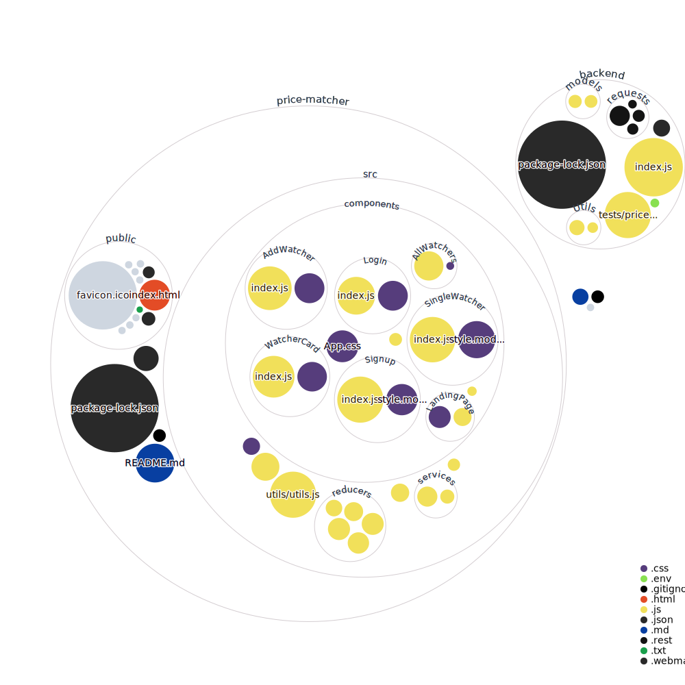

# Price-Watcher

A webapp to keep track of prices of any product on amazon and send an email whenever the price goes below a threshold price.

### Live Demo

For live demo check-out [https://pricewatcher.surge.sh/](https://pricewatcher.surge.sh/)

### Prerequisites

<ul>
<li>Node</li>
<li>npm</li>
<li>git</li>
</ul>

### Get Started

- clone the repo
- go into the repo `cd Price-Watcher`
- cd into the backend and install dependencies `cd backend && npm install`
- start the server `npm run dev`
- go to frontend and install dependencies `cd ../price-matcher && npm install`
- start the server `npm start`

### Features

- You can track price of any product on amazon
- You can set a threshold price and if price of product goes below threshold price an email will be sent
- You can view the changes in price from the day that you added the product
- View metrics of the product like maximum price, minimum price, average price etc.

### Technologies used

ReactJs has been used to make the frontend of the project.
Node is used for backend.
MongoDB is used as database.

# Visualization of the code

